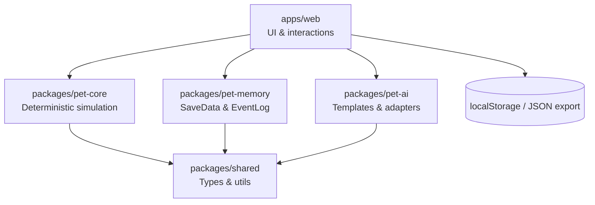

# AI Pet (V0.1)

[](https://marsdoge.github.io/ai-pet/)

A tiny **virtual pet** you can grow with — featuring **offline progression**, **deterministic simulation**, and **optional AI dialogue** (bring your own LLM API).

> V0.1 focus: **pet experience first** (state, actions, progression).  
> AI is an enhancement, not a dependency.

---

## Features (V0.1)

### Pet experience
- Floating pet UI (drag around) with speech bubbles
- Core stats: hunger, energy, cleanliness, fun, affection, level/exp, coins
- Actions: feed, pet, bath, play, sleep + chat
- Inventory (foods/toys) and basic usage
- Offline progression via tick compensation
- Save export/import (JSON)

### Optional AI
- Pet-style chat: persona + current state + recent events
- Pluggable LLM adapters (OpenAI/DeepSeek/Ollama-compatible)
- Works without AI (template fallback)

### Controlled “initiative”
- Auto-speak triggers (hungry / tired / dirty / long idle)
- Daily cap + user toggle
- Every auto message is logged

---

## Quickstart

### Requirements
- Node.js 18+
- pnpm

### Run locally
```bash
pnpm install
pnpm --filter web dev
```

Open the local URL printed by Next.js.

### GitHub Pages (static export)
Static export output is generated in `apps/web/out` for GitHub Pages.
When deploying under a repo path (e.g. `/ai-pet`), set `NEXT_PUBLIC_BASE_PATH=/ai-pet` during build.

Demo: https://marsdoge.github.io/ai-pet/

### Tests
```bash
pnpm -r test
```

---

## Configuration

Copy `.env.example` to `.env` (inside `apps/web/`) and adjust:

- `NEXT_PUBLIC_LLM_PROVIDER=none|openai|deepseek|ollama`
- `LLM_API_KEY=...`
- `LLM_BASE_URL=...` (optional; for compatible endpoints)
- `NEXT_PUBLIC_AUTO_SPEAK_LIMIT_PER_DAY=8`

**No API key?** Set provider to `none` and the app will use templates.

---

## Project structure

```
apps/web            # UI
packages/pet-core   # deterministic simulation (events/reducer/tick)
packages/pet-memory # KV + event log + save import/export
packages/pet-ai     # persona + adapters + templates (no state mutation)
packages/shared     # shared types/utils
docs/               # specs & contributor docs
```

Key rule: **AI never mutates numeric state**. Only `pet-core` does.

---

## Architecture diagram



---

## Module responsibilities

### `packages/pet-core`
- Deterministic state model, events, reducers, and tick compensation.
- Computes numeric deltas and enforces stat clamps.
- Sole source of truth for gameplay rules.

### `packages/pet-memory`
- SaveData schema, version checks, and import validation.
- KV storage and capped EventLog management.
- Serialization for persistence and export/import.

### `packages/pet-ai`
- Template replies and LLM adapter interfaces.
- Structured AI reply shape (text/tags/suggestions only).
- Never mutates numeric state.

### `apps/web`
- UI components, event dispatch, and rendering.
- Boot flow (load → tick compensate → render).
- Local persistence, export/import, and auto-speak UX.

### `packages/shared`
- Cross-package types, utilities, and versioned contracts.
---

## Roadmap

### V0.1
- Playable pet loop + save/load + offline ticks
- Optional AI chat + auto-speak with caps

### V0.5
- Tasks/achievements, shop, outfits/backgrounds
- Light mini-games
- Stronger memory (weekly summaries, optional vector memory)
- Personality traits affecting tone/initiative

### V1.0
- Desktop packaging (Tauri): tray/always-on-top/hotkeys
- Plugin system (actions/items/skins)
- Optional tool integrations with strict permissions and logs

---

## Contributing

- Read: `docs/DEV_SPEC.md` and `docs/CODEX_RULES.md`
- Open issues using the labels:
  - `area:core`, `area:memory`, `area:ai`, `area:web`, `area:docs`, `area:ci`
- PRs should include tests for `pet-core`/`pet-memory` changes.

---

## License
GPL-3.0
