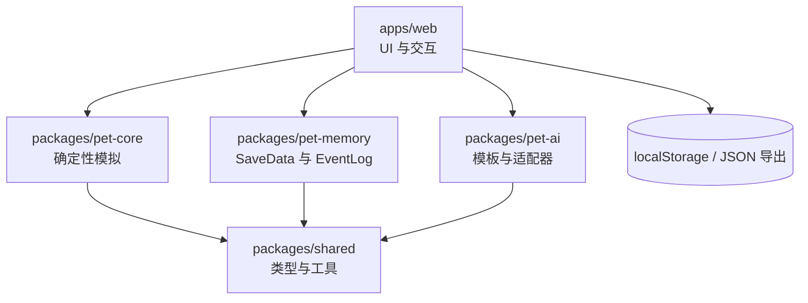

# AI Pet (V0.1)

[](https://marsdoge.github.io/ai-pet/)

一个可以陪你一起成长的**虚拟宠物**——包含**离线进度**、**确定性模拟**，以及**可选 AI 对话**（自备 LLM API）。

> V0.1 重点：**先把宠物体验做对**（状态、动作、成长）。  
> AI 是增强项，不是依赖项。

---

## 功能（V0.1）

### 宠物体验
- 可拖拽的悬浮宠物 UI + 气泡
- 核心数值：饥饿、精力、清洁、快乐、亲密、等级/经验、金币
- 动作：喂食、抚摸、洗澡、玩耍、睡觉 + 聊天
- 背包（食物/玩具）与基础使用
- 通过 tick 补偿实现离线成长
- 存档导出/导入（JSON）

### 可选 AI
- 宠物式聊天：人格 + 当前状态 + 近期事件
- 可插拔 LLM 适配（OpenAI/DeepSeek/Ollama 兼容）
- 无 AI 时自动使用模板回复

### 受控“主动性”
- 自动说话触发（饥饿/疲劳/脏乱/长时间 idle）
- 每日上限 + 用户开关
- 每条自动消息都会记录在日志中

---

## 快速开始

### 环境要求
- Node.js 18+
- pnpm

### 本地运行
```bash
pnpm install
pnpm --filter ./apps/web dev
```

打开 Next.js 输出的本地地址即可。

### GitHub Pages（静态导出）
静态导出产物位于 `apps/web/out`，用于 GitHub Pages 部署。
当部署在仓库子路径（如 `/ai-pet`）时，构建需设置 `NEXT_PUBLIC_BASE_PATH=/ai-pet`。

演示地址：https://marsdoge.github.io/ai-pet/

### 测试
```bash
pnpm -r test
```

---

## 配置

将 `apps/web/.env.example` 复制为 `apps/web/.env` 并修改：

- `NEXT_PUBLIC_LLM_PROVIDER=none|openai|deepseek|ollama`
- `LLM_API_KEY=...`
- `LLM_BASE_URL=...`（可选，兼容端点）
- `NEXT_PUBLIC_AUTO_SPEAK_LIMIT_PER_DAY=8`

**没有 API key？** 将 provider 设为 `none`，应用会使用模板回复。

---

## 项目结构

```
apps/web            # UI
packages/pet-core   # 确定性模拟（events/reducer/tick）
packages/pet-memory # KV + 事件日志 + 存档导入导出
packages/pet-ai     # persona + adapters + templates（不改数值）
packages/shared     # 共享类型/工具
docs/               # 规格与贡献者文档
```

关键规则：**AI 永远不修改数值状态**，只有 `pet-core` 可以。

---

## 架构图



---

## 模块职责

### `packages/pet-core`
- 确定性状态模型、事件、reducer 与 tick 补偿。
- 计算数值 delta 并强制范围 clamp。
- 唯一的游戏规则来源。

### `packages/pet-memory`
- SaveData 结构、版本校验与导入修复。
- KV 存储与 EventLog（200 条截断）。
- 持久化与导出/导入序列化。

### `packages/pet-ai`
- 模板回复与 LLM 适配器接口。
- 结构化 AI 回复（文本/标签/建议动作）。
- 永不修改数值状态。

### `apps/web`
- UI 组件、事件派发与渲染。
- 启动流程（load → tick 补偿 → render）。
- 本地持久化、导出/导入与自动说话 UX。

### `packages/shared`
- 跨包公共类型与工具、版本化契约。
---

## 路线图

### V0.1
- 可玩的宠物循环 + 存档读写 + 离线 tick
- 可选 AI 聊天 + 自动说话（带上限）

### V0.5
- 任务/成就、商店、装扮/背景
- 轻量小游戏
- 更强记忆（周总结、可选向量记忆）
- 性格特质影响语气/主动性

### V1.0
- 桌面端（Tauri）：托盘/置顶/快捷键
- 插件系统（动作/物品/皮肤）
- 可选工具集成（严格权限 + 日志）

---

## 贡献指南

- 阅读：`docs/DEV_SPEC.md` 与 `docs/CODEX_RULES.md`
- 使用标签提交 Issue：
  - `area:core`, `area:memory`, `area:ai`, `area:web`, `area:docs`, `area:ci`
- 涉及 `pet-core`/`pet-memory` 的改动必须附带测试

## 社区与治理

- 社区可通过内容包与插件贡献玩法与素材。
- AI 负责内容冲突裁决与优先级调度（文本层）。
- 数值规则只在 `pet-core` 中维护，AI 不得修改。

## 新人入门

建议先读：
- `docs/INDEX.md`
- `docs/ARCHITECTURE.md`
- `docs/EXECUTION_PLAN.zh-CN.md`

---

## 许可协议
GPL-3.0
